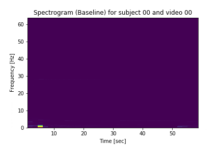
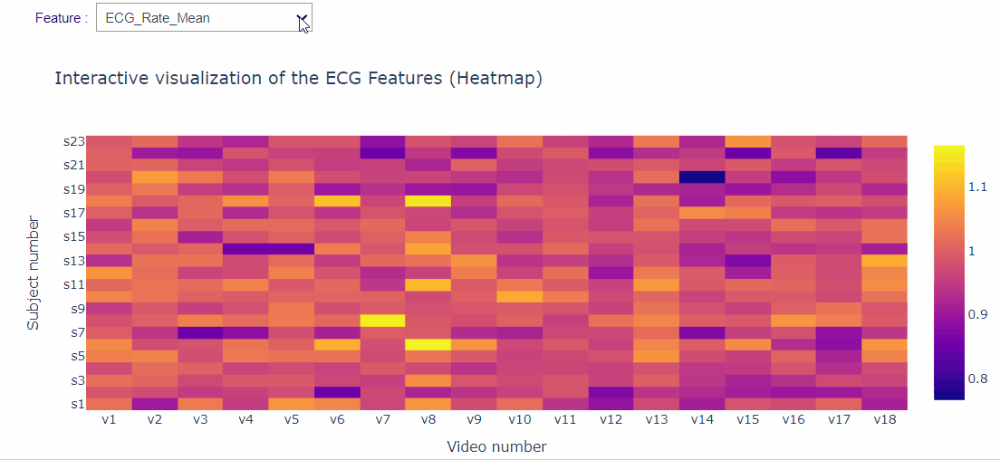

### Biosignal processing for automatic emotion recognition

#### by the Effective Affective Team 
##### AKA Danielle & Achraf
Made with GitPitch (thank you Agah!)

 Link to this presentation :
  
  https://gitpitch.com/brainhack-school2020/Biosignal-Emotions-BHS-2020 

---

# Punchline !

---

## Outline 

1. Project definition
2. Tools
3. Biosignals data
4. Emotional data
5. Machine Learning aspect
6. What we learned in BHS2020

---

## Project idea

### Goal 
Predicting affective states based on biosignals for automatic stress detection in a wearable

### Dataset

DREAMER dataset: Participants were shown videos intended to elicit certain emotions while wearing an EEG headset and ECG sensors

 (The DREAMER dataset must be requested to the authors : https://ieeexplore.ieee.org/document/7887697 ) 

---

## Tools

- Can read .MAT files in python
-Example for EEG :
Easy specification of Theta, Alpha, Beta bands
Filter the signal
Compute PSD (Welch)

 Interactive data visualization (Exploration) 

---

## Tools

Example for ECG : 2 lines to extract Features !

---

### Big data : Overview

23 subjects x 18 videos x 2 paradigms = 828 EEG recordings (x14 electrodes)!

Hard to extract relevant features from so many Biosignals !

---

### Biosignals preprocessing : Features extraction

EEG

Theta band : 8Hz - 16Hz
Alpha band : 16Hz - 26 Hz
Beta band   : 26 Hz - 60Hz

Maximum of the PSDs for each of the 14 electrodes

---

### Biosignals preprocessing : Features extraction

ECG

Neurokit2 automatically extracts features

---

### Exploring the data

---

### Exploring the data

---
### Valence and Arousal versus Biosignal Features
### Pearson's correlation

---

@snap[north span-100]
### Emotion data
@snapend

@snap[south span-100]
<iframe src="https://brainhack-school2020.github.io/Biosignal-Emotions-BHS-2020/" width="1000" height="500" frameborder="0" marginwidth="0" marginheight="0"></iframe>
@snapend

---

@snap[north span-100]
### Cross-validation
@snapend

@snap[south span-100]
<iframe src="https://brainhack-school2020.github.io/Biosignal-Emotions-BHS-2020/DREAMER_group_cross_validation.html" width="1000" height="500" frameborder="0" marginwidth="0" marginheight="0"></iframe>
@snapend

---

## What we learned in the BHS2020

- Distance teamwork
- Enhanced our Python skills
- Modern data visualization tools and practices

---

# Thank you!
